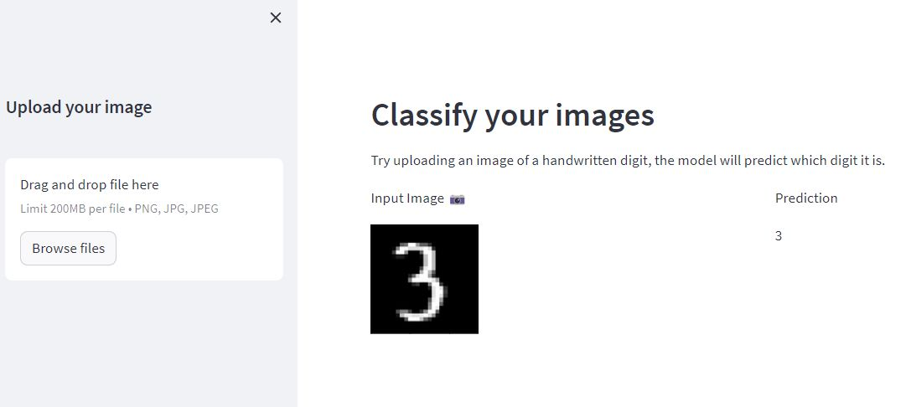

# mini-project-streamlit

This repository contains a Streamlit application for digit classification using a Convolutional Neural Network (CNN) model trained on the MNIST dataset.

## Link
Public URL for the app is - https://mini-project-part2.streamlit.app/

## Application Overview

The application accepts an image of a handwritten digit as input. It preprocesses the image and feeds it to a pre-trained CNN model to predict the digit in the image.

## Screenshots
""

## Model Architecture

The CNN model used in this application has the following layers:

- A Conv2D layer with 64 kernels of size 3 and ReLU activation
- A second Conv2D layer with 32 kernels of size 3 and ReLU activation
- A MaxPooling2D layer with pool size 2x2
- A Flatten layer to convert the 2D matrix to a 1D array
- A Dense layer with 10 neurons (corresponding to the 10 digits 0-9) and softmax activation

## Running the Application

To run the application:

1. Install the necessary Python packages. This includes `streamlit`, `Pillow`, `tensorflow`, `keras`, and `numpy`. You can install them using pip:

   ```bash
   pip install streamlit Pillow tensorflow keras numpy

2. To run the streamlit app locally
    ```bash
    streamlit app.py